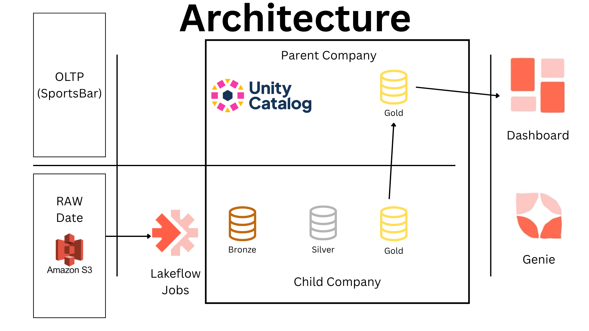
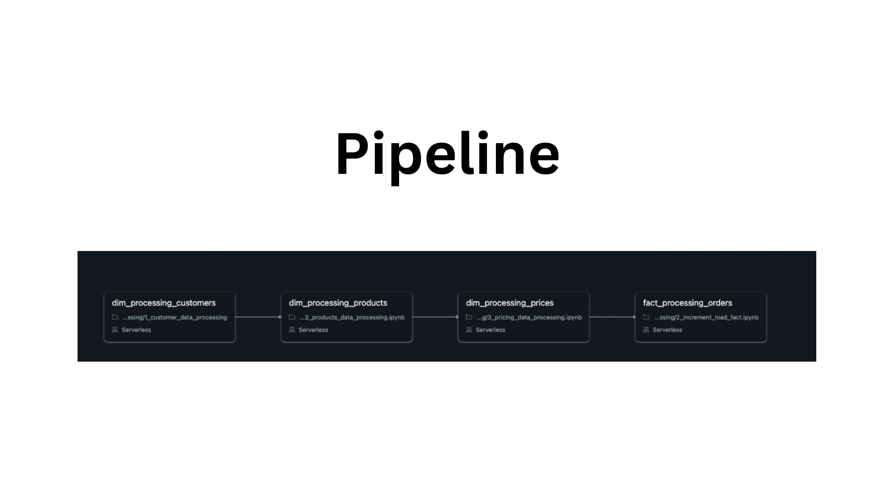
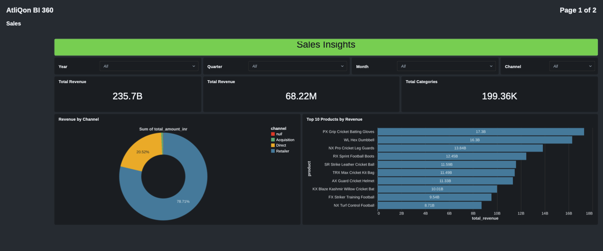

# FMCG Merger Data Pipeline (Databricks)

End-to-end data engineering pipeline built on **Databricks Free Edition** for a fictional FMCG merger: **Atlon** (parent) acquires **Sports Bar** (child). The goal is to consolidate messy child-company sources (Excel, WhatsApp exports, APIs) with parent reporting into a **single, reliable, scalable** analytics layer and dashboard.

---

## Architecture

Data follows **Medallion Architecture** (Bronze → Silver → Gold) inside **Unity Catalog**, with **AWS S3** as the data lake for raw child files. Parent (Atlon) historical data is treated as already curated and lands **directly in Gold**; child data is ingested from S3 through Bronze and Silver, written to child-specific Gold tables, then **merged** into consolidated parent Gold tables.

The **star schema** used for reporting includes dimension tables (Customers, Products, Gross Price, Date) and a fact table (**Orders**).



---

## Tech stack

| Area | Technologies |
|------|----------------|
| Processing | Python, PySpark, SQL |
| Storage & format | Delta Lake, Unity Catalog (`fmcg` catalog, `bronze` / `silver` / `gold` schemas) |
| Data lake | AWS S3 (landing, processed archive) |
| Platform | Databricks Community / Free Edition |
| Orchestration | Lakeflow Jobs (multi-task pipeline) |
| Analytics | Databricks SQL, One Big Table (OBT) view, Databricks Genie, Databricks Dashboards |

---

## Repository structure

```
consolidated_pipeline/
├── 1_setup/
│   ├── setup_catalogs.ipynb          # FMCG catalog + bronze/silver/gold schemas
│   └── dim_date_table_creation.ipynb # PySpark-generated date dimension (Y/Q/M keys)
├── 2_dimension_data_processing/
│   ├── 1_customer_data_processing.ipynb
│   ├── 2_products_data_processing.ipynb.ipynb
│   └── 3_pricing_data_processing.ipynb.ipynb
├── 3_fact_data_processing/
│   ├── 1_full_load_fact.ipynb
│   └── 2_increment_load_fact.ipynb.ipynb
└── utilities.ipynb                   # Shared helpers
```

| Notebook | Role |
|----------|------|
| [`1_setup/setup_catalogs.ipynb`](consolidated_pipeline/1_setup/setup_catalogs.ipynb) | Creates the `fmcg` catalog and `bronze`, `silver`, `gold` schemas. |
| [`1_setup/dim_date_table_creation.ipynb`](consolidated_pipeline/1_setup/dim_date_table_creation.ipynb) | Builds the **Date** dimension programmatically (year, quarter, month keys) with PySpark. |
| [`2_dimension_data_processing/1_customer_data_processing.ipynb`](consolidated_pipeline/2_dimension_data_processing/1_customer_data_processing.ipynb) | **Customers**: Bronze → Silver (dedupe, trim, city mapping e.g. Bangalore/Bengaluru) → Gold; `MERGE INTO` consolidated parent dim. |
| [`2_dimension_data_processing/2_products_data_processing.ipynb.ipynb`](consolidated_pipeline/2_dimension_data_processing/2_products_data_processing.ipynb.ipynb) | **Products**: Regex typo fixes, category → division mapping, variant split from names, SHA-based surrogate `product_code`. |
| [`2_dimension_data_processing/3_pricing_data_processing.ipynb.ipynb`](consolidated_pipeline/2_dimension_data_processing/3_pricing_data_processing.ipynb.ipynb) | **Pricing**: `try_to_date` + `coalesce` for mixed date formats; negative/unknown prices normalized; **window functions** for latest monthly price aligned to parent yearly price needs. |
| [`3_fact_data_processing/1_full_load_fact.ipynb`](consolidated_pipeline/3_fact_data_processing/1_full_load_fact.ipynb) | **Full fact load**: Bronze from S3; clean nulls, bad customer IDs (e.g. 9999), regex strip of weekday names from dates; **monthly aggregation** by product/customer; archive files with `dbutils.fs.mv`; merge into `fact_orders`. |
| [`3_fact_data_processing/2_increment_load_fact.ipynb.ipynb`](consolidated_pipeline/3_fact_data_processing/2_increment_load_fact.ipynb.ipynb) | **Incremental orders**: staging strategy, affected months only, re-aggregate with history, `MERGE INTO` Gold. |
| [`utilities.ipynb`](consolidated_pipeline/utilities.ipynb) | Shared utilities. |

---

## Pipeline and orchestration

A **Lakeflow** (Databricks) multi-task job runs the dimension chain before facts so joins stay consistent:

1. `dim_processing_customers`
2. `dim_processing_products`
3. `dim_processing_prices`
4. `fact_processing_orders` (incremental fact notebook)

Tasks use **Serverless** compute in the reference setup. Schedule the job with **cron** (e.g. daily at **11:00 PM**) after business hours for daily refreshes.



---

## Medallion layers (summary)

- **Bronze**  
  Raw CSVs from S3 ingested to Delta with **audit metadata** (e.g. read timestamp, source file name).

- **Silver**  
  Entity-specific cleaning: customers (dedupe, trim, city dictionary), products (regex, division mapping, surrogate keys), pricing (date normalization, non-negative numeric rules).

- **Gold**  
  Child-specific Gold tables (e.g. `sb_dim_*`) and **consolidated parent** tables. Dimensions upserted with **`MERGE INTO`**. Facts: child **daily** transactions **aggregated to monthly** grain to match the parent schema before merge.

---

## Incremental load (facts)

For new files (e.g. a new December extract):

1. Land new data in a **staging** path / staging tables.
2. Determine **months touched** by the new load.
3. Pull existing Gold rows for those months, **re-aggregate** with the new data.
4. **`MERGE INTO`** the final `fact_orders` (or equivalent) so the warehouse stays correct without reprocessing all history every run.

---

## Analytics and visualization

- **One Big Table (OBT)**  
  A Gold-layer **SQL view** joins fact and all dimensions into one denormalized table for fast dashboard queries.

- **Databricks Genie**  
  Natural-language questions over the Gold layer (e.g. “Top 5 products by revenue”) to sanity-check metrics.

- **BI dashboard**  
  Built in Databricks SQL; example **AtliQon BI 360** Sales page includes:
  - **Global filters**: Year, Quarter, Month, Channel  
  - **KPIs**: Total Revenue, Total Quantity (and related counters)  
  - **Charts**: Top products (bar), revenue share by channel (donut/pie), monthly sales trends  



---

## How to reproduce (high level)

1. Create a **Databricks** workspace (Community / Free Edition is enough for the learning path).
2. Run **`setup_catalogs`** to create the `fmcg` catalog and schemas.
3. Load parent reference data into **Gold** as in your project (CSVs / established pipeline).
4. Run **`dim_date_table_creation`** for the date dimension.
5. Configure **AWS S3** (bucket, paths for landing vs archive) and a **secure external connection** from Databricks to S3.
6. Execute dimension notebooks in order (**customers → products → pricing**), then **full load** facts, then wire **incremental** facts for ongoing loads.
7. Create a **Lakeflow Job** with the same task order as above; add a **daily cron** if desired.
8. Publish the **OBT** view, validate with **Genie**, and build the **SQL Dashboard** on top of Gold.
